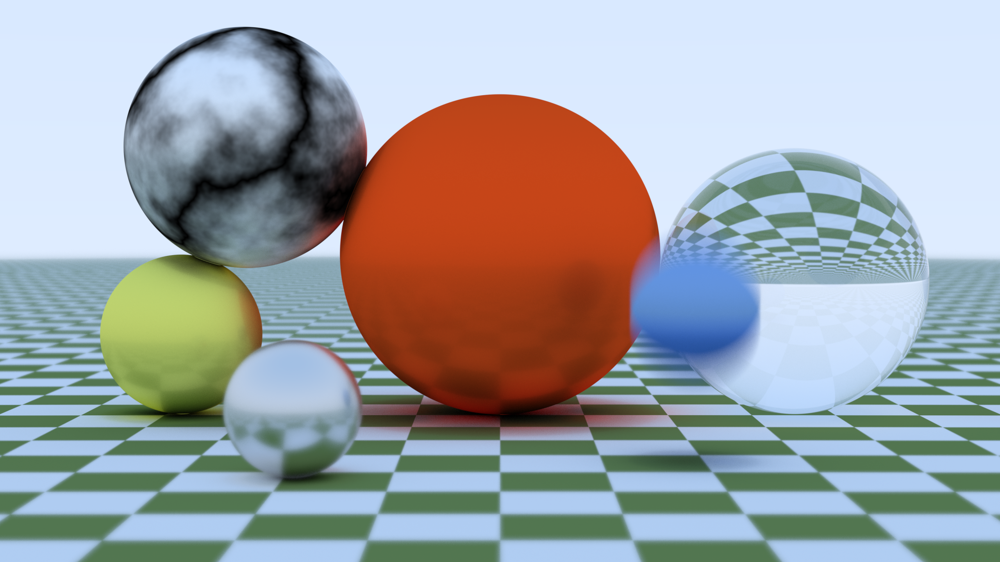
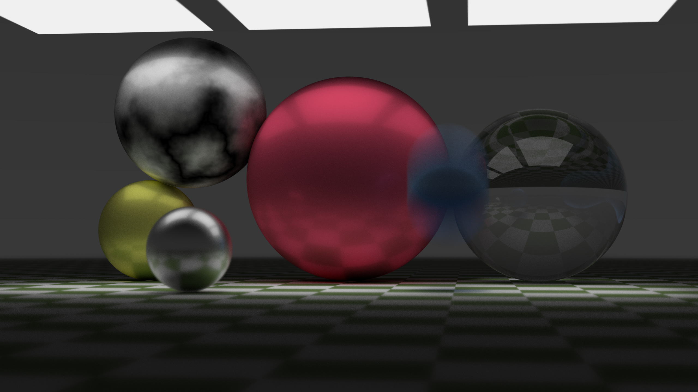

# wasm-based raytracer





A simple raytracer written in the rust programming language. Relies on web assembly and web workers support in the browser.
To run do:

````sh
npm install
npm run serve
````

Then navigate to localhost:8080 to run the raytracer by adjusting number of rays per pixel and clicking on the render button.

Warning: it will take probably over a minute to render an image with more than 50 rays per pixel. Try using jittered sampling for better perfromance.

To rebuild wasm tracer use rust nightly compiler and run:

````sh
npm run build:wasm
````
